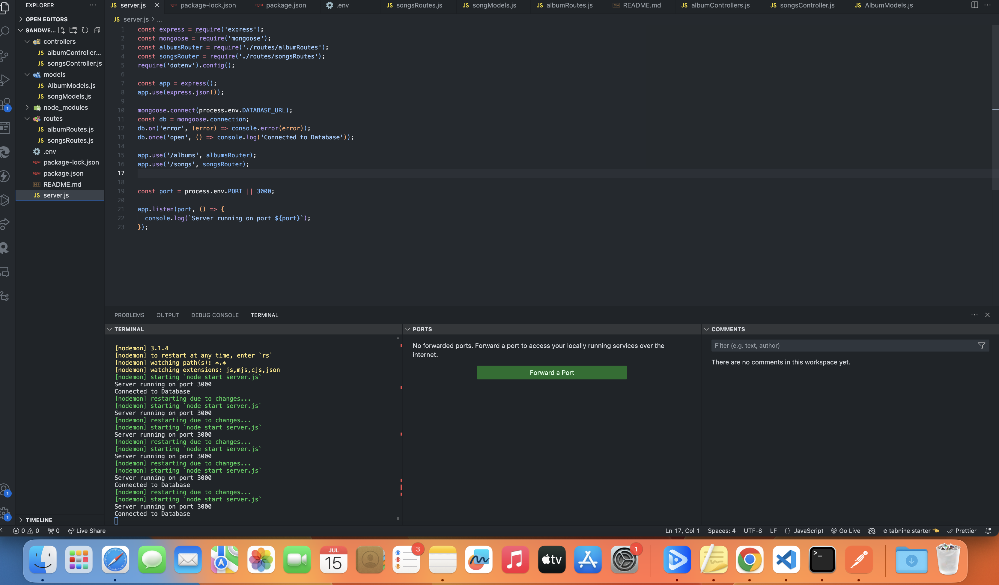
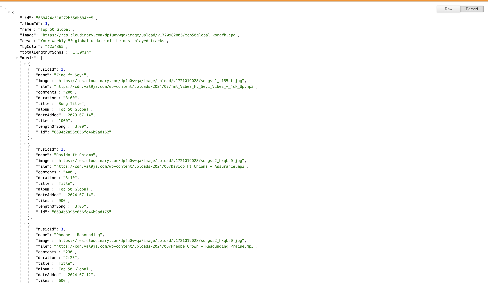
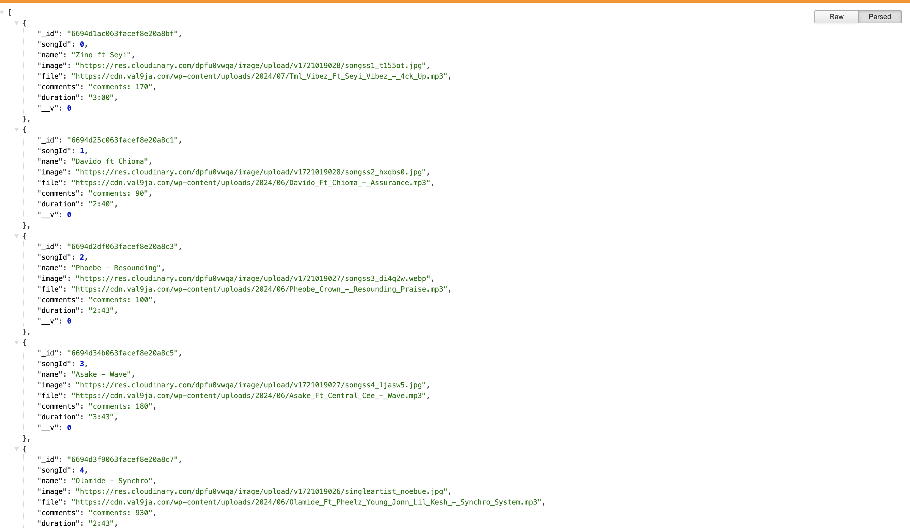
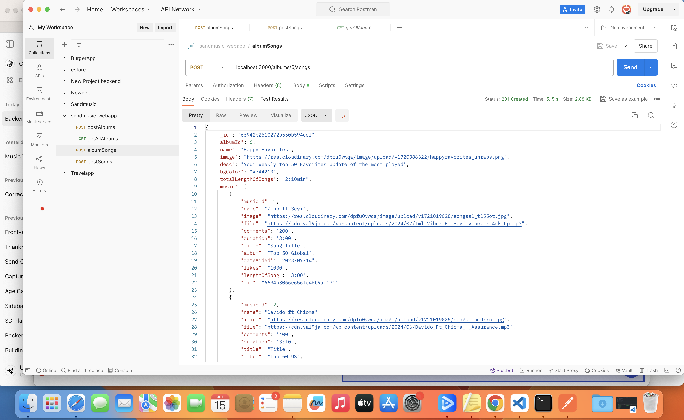

Sand Music Web App Backend

Introduction

The Sand Music Web App backend manages and serves music albums and songs. It offers a RESTful API built with Node.js, Express, and MongoDB.

Features

Albums and Songs Management

RESTful API Endpoints

Technologies Used

Node.js
Express
MongoDB
Mongoose
Installation

Clone the repository:

Install dependencies:

npm install

Environment Variables: Create a .env file with:

Start the server:

npm start
API Endpoints

Albums
Get all albums

http
GET /albums
Create a new album

http
POST /albums

json

{
  "albumId": 0,

  "name": "Top 50 Global",

  "image": "image_url",

  "desc": "Weekly update of the most played tracks",

  "bgColor": "#2a4365",

  "totalLengthOfSongs": "0:00",

  "music": []
}

Add a song to an album

http

POST /albums/:albumId/songs

json

{ 
  "musicId": 1, 

  "name": "Song First", 

  "image": "song_image_url", 

  "file": "song_file_url", 

  "comments": "200", 

  "duration": "3:00", 

  "title": "Song Title" 

  "album": "Top 50 Global", 

  "dateAdded": "2023-07-14", 

  "likes": "1000", 

  "lengthOfSong": "3:00" 
}

Testing with Postman

Create a new album

Method: POST

URL: http://localhost:3000/albums

Body: (raw JSON)

json

{
  "albumId": 0,  

  "name": "Top 50 Global",  

  "image": "image_url",  

  "desc": "Weekly update of the most played tracks",  

  "bgColor": "#2a4365",  

  "totalLengthOfSongs": "0:00", 

  "music": []
}

Add a song to an album

Method: POST

URL: http://localhost:3000/albums/0/songs

Body: (raw JSON)

json

{
  "musicId": 1,  

  "name": "Song First",  

  "image": "song_image_url",  

  "file": "song_file_url",  

  "comments": "200",  

  "duration": "3:00", 

  "title": "Song Title", 

  "album": "Top 50 Global",  

  "dateAdded": "2023-07-14",  

  "likes": "1000", 

  "lengthOfSong": "3:00" 
}